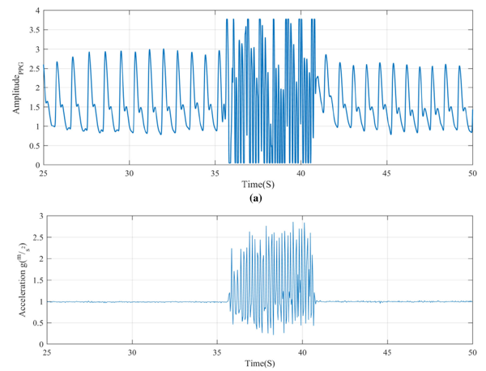
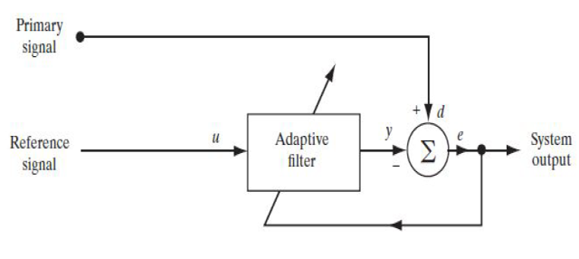
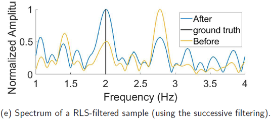
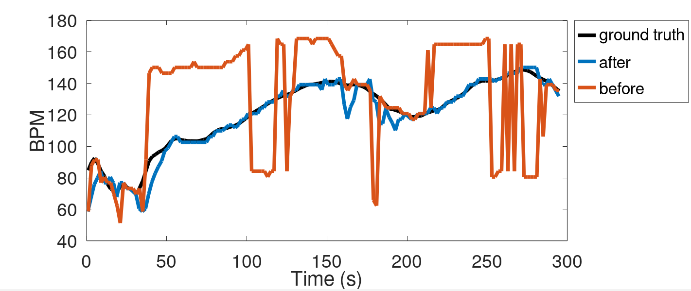

# PPG Heart Rate Estimation

## Description
This project implements heart rate estimation from PPG signals using adaptive filtering and signal processing techniques. Accelerometer signals are used as a noise reference for motion artifact reduction.

---

## Main Script: `Main_ppg`
This is the main script of the project. Running it generates 22 figures representing:
- Filtered signals
- Estimated heart rates
- Final results

---

## Function: `hr_estimate`
This function implements the full heart rate estimation pipeline described in the report, including:
- Bandpass filtering
- Adaptive filtering
- Heart rate detection
- Heart rate validation

---

## Function: `adaptive_filtering_and_HR_detection`
This function estimates heart rate from the adaptively filtered PPG signal using the highest peak frequency.

Differences from `hr_estimate`:
- No heart rate validation
- No failure handling of adaptive filtering
- Only adaptive filtering + peak detection

---

## Adaptive Filtering Algorithms

### `lms_filtering`
Least Mean Squares (LMS) adaptive filtering algorithm.

### `nlms`
Normalized Least Mean Squares (NLMS) adaptive filtering algorithm.

### `rls_ppg`
Recursive Least Squares (RLS) adaptive filtering algorithm.

---

## Pipeline Flow
Main_ppg → hr_estimate → adaptive_filtering_and_HR_detection → (LMS / NLMS / RLS)

## Accelerometer Reference Signal

The accelerometer signal is used as a noise reference for the adaptive filter. Motion artifacts in the PPG signal are often correlated with body movements captured by the accelerometer. This relationship allows the adaptive filter to estimate and suppress motion-induced noise.

---

## Adaptive Filtering Framework

Adaptive filtering paradigm used in this project. The corrupted PPG signal and the accelerometer reference signal are provided as inputs to the adaptive filter, which estimates the noise component and removes it to recover a cleaner PPG signal.

---

## RLS Filtering Example

Example of Recursive Least Squares (RLS) filtering applied to the corrupted PPG signal. The figure illustrates the capability of the RLS algorithm to suppress motion artifacts while preserving the heart-rate-related information.

## Long-Duration Heart Rate Estimation (300 s)

Heart rate estimation over a 300-second signal segment. This example demonstrates the robustness and stability of the proposed algorithm over long-duration recordings. The results show that the method is not restricted to short signal windows and is capable of maintaining reliable heart rate tracking over extended periods.

